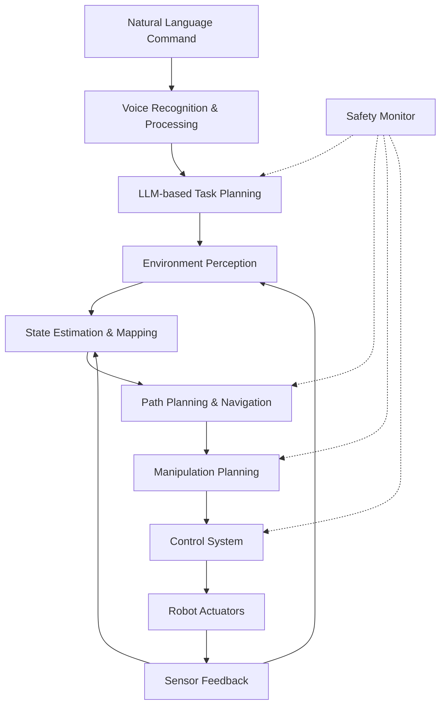

# Hands-on Labs - Autonomous Humanoid Capstone

## Lab 1: System Architecture and Integration Planning

### Objective
Design the complete system architecture for the autonomous humanoid robot.

### Prerequisites
- Understanding of all previous modules
- Access to system design tools
- Robot platform specifications

### Steps
1. Create system architecture diagram:


2. Define system interfaces and data flow:
```python
class AutonomousHumanoidSystem:
    def __init__(self):
        # Initialize all system components
        self.voice_recognition = VoiceRecognitionSystem()
        self.task_planner = TaskPlanningSystem()
        self.perception = PerceptionSystem()
        self.navigation = NavigationSystem()
        self.manipulation = ManipulationSystem()
        self.control = ControlSystem()
        self.safety_monitor = SafetyMonitoringSystem()

        # Define data structures
        self.system_state = SystemState()
        self.command_queue = CommandQueue()
        self.safety_constraints = SafetyConstraints()

    def execute_cycle(self):
        # Main execution cycle
        command = self.voice_recognition.process_input()
        if command:
            plan = self.task_planner.generate_plan(command, self.system_state)
            self.safety_monitor.validate_plan(plan)
            self.execute_plan(plan)
```

3. Plan integration strategy:
   - Component integration order
   - Interface specifications
   - Testing approach for each integration step
   - Fallback and safety procedures

## Lab 2: Component Integration and Testing

### Objective
Integrate individual components from previous modules into a unified system.

### Steps
1. Implement the main integration framework:
```python
class HumanoidIntegrationFramework:
    def __init__(self):
        # Initialize all subsystems from previous modules
        self.ros_nervous_system = ROSNervousSystem()
        self.digital_twin = DigitalTwinSystem()
        self.ai_robot_brain = AIRobotBrainSystem()
        self.vla_system = VLASystem()

        # Initialize communication layer
        self.message_bus = ROS2MessageBus()

        # Initialize safety systems
        self.emergency_stop = EmergencyStopSystem()
        self.safety_monitor = IntegratedSafetyMonitor()

    def integrate_components(self):
        # Connect perception to planning
        self.connect_perception_to_planning()

        # Connect planning to control
        self.connect_planning_to_control()

        # Connect safety systems
        self.connect_safety_systems()

        # Validate all connections
        self.validate_integration()

    def connect_perception_to_planning(self):
        # Connect perception output to planning input
        self.perception.environment_state_publisher.connect(
            self.planning.environment_state_subscriber
        )

    def connect_planning_to_control(self):
        # Connect planning output to control input
        self.planning.motion_plan_publisher.connect(
            self.control.motion_plan_subscriber
        )

    def connect_safety_systems(self):
        # Connect safety monitors to all critical components
        self.safety_monitor.monitor_component(self.perception)
        self.safety_monitor.monitor_component(self.planning)
        self.safety_monitor.monitor_component(self.control)
```

2. Test individual component integration:
   - Verify data flow between components
   - Test error handling and recovery
   - Validate safety constraints
   - Measure performance metrics

3. Implement system monitoring:
```python
class SystemMonitor:
    def __init__(self):
        self.metrics = {}
        self.health_status = {}
        self.performance_log = []

    def monitor_component(self, component_name, component):
        # Monitor component health and performance
        health = component.get_health_status()
        performance = component.get_performance_metrics()

        self.health_status[component_name] = health
        self.metrics[component_name] = performance

        # Log performance for analysis
        self.performance_log.append({
            'timestamp': time.time(),
            'component': component_name,
            'health': health,
            'performance': performance
        })
```

## Lab 3: End-to-End System Development

### Objective
Develop and test complete end-to-end tasks for the autonomous humanoid.

### Steps
1. Create end-to-end task execution system:
```python
class EndToEndTaskExecutor:
    def __init__(self, integrated_system):
        self.system = integrated_system
        self.task_library = TaskLibrary()
        self.execution_monitor = ExecutionMonitor()

    def execute_task(self, task_description):
        # Parse natural language task
        parsed_task = self.parse_task(task_description)

        # Plan the task using integrated system
        plan = self.system.task_planner.plan_task(parsed_task)

        # Validate plan safety
        if not self.system.safety_monitor.validate_plan(plan):
            raise SafetyViolationError("Plan violates safety constraints")

        # Execute plan with monitoring
        execution_result = self.execute_with_monitoring(plan)

        # Return results
        return execution_result

    def parse_task(self, task_description):
        # Use LLM to parse natural language task
        parsed_task = self.system.vla_system.parse_command(task_description)
        return parsed_task

    def execute_with_monitoring(self, plan):
        # Execute plan with continuous monitoring
        for step in plan.steps:
            # Monitor execution
            if not self.execution_monitor.is_safe_to_proceed(step):
                return ExecutionResult.SAFE_ABORT

            # Execute step
            result = self.system.execute_step(step)

            # Update monitoring
            self.execution_monitor.update_execution_state(step, result)

            if result.status == ExecutionStatus.FAILURE:
                return ExecutionResult.FAILURE

        return ExecutionResult.SUCCESS
```

2. Implement complex task examples:
   - Navigation and manipulation tasks
   - Multi-modal interaction tasks
   - Social robotics tasks
   - Long-term autonomy tasks

3. Test with various scenarios:
   - Simple navigation tasks
   - Complex manipulation tasks
   - Multi-step reasoning tasks
   - Error recovery scenarios

## Lab 4: Performance Optimization and Validation

### Objective
Optimize system performance and validate the complete autonomous humanoid.

### Steps
1. Implement performance profiling:
```python
class PerformanceProfiler:
    def __init__(self, system):
        self.system = system
        self.profiles = {}

    def profile_component(self, component_name, test_function, iterations=100):
        start_time = time.time()

        for i in range(iterations):
            test_function()

        end_time = time.time()
        avg_time = (end_time - start_time) / iterations

        self.profiles[component_name] = {
            'avg_time': avg_time,
            'iterations': iterations,
            'total_time': end_time - start_time
        }

        return avg_time

    def profile_system_performance(self):
        # Profile each system component
        self.profile_perception()
        self.profile_planning()
        self.profile_control()
        self.profile_safety()

        # Generate performance report
        return self.generate_performance_report()

    def optimize_component(self, component_name):
        # Apply optimizations based on profiling results
        profile = self.profiles[component_name]

        if profile['avg_time'] > self.get_threshold(component_name):
            # Apply specific optimizations
            self.apply_optimizations(component_name)
```

2. Implement system validation tests:
```python
class SystemValidator:
    def __init__(self, system):
        self.system = system
        self.test_results = {}

    def run_comprehensive_tests(self):
        # Run all validation tests
        results = {
            'functionality_tests': self.run_functionality_tests(),
            'performance_tests': self.run_performance_tests(),
            'safety_tests': self.run_safety_tests(),
            'reliability_tests': self.run_reliability_tests()
        }

        self.test_results = results
        return results

    def run_functionality_tests(self):
        # Test all system functions
        tests = [
            self.test_navigation(),
            self.test_manipulation(),
            self.test_perception(),
            self.test_interaction(),
            self.test_safety()
        ]

        return all(tests)

    def run_performance_tests(self):
        # Measure system performance
        metrics = {
            'task_success_rate': self.measure_task_success_rate(),
            'response_time': self.measure_response_time(),
            'energy_efficiency': self.measure_energy_efficiency(),
            'reliability': self.measure_reliability()
        }

        return metrics
```

3. Optimize based on profiling results:
   - Identify bottlenecks
   - Apply appropriate optimizations
   - Re-test and validate improvements

## Lab 5: Final Testing and Documentation

### Objective
Complete final system testing and create comprehensive documentation.

### Steps
1. Create comprehensive test suite:
```python
class CapstoneTestSuite:
    def __init__(self, system):
        self.system = system
        self.test_scenarios = []
        self.test_results = {}

    def add_test_scenario(self, name, description, success_criteria):
        self.test_scenarios.append({
            'name': name,
            'description': description,
            'success_criteria': success_criteria
        })

    def run_all_tests(self):
        results = {}

        for scenario in self.test_scenarios:
            result = self.run_test_scenario(scenario)
            results[scenario['name']] = result

        self.test_results = results
        return results

    def run_test_scenario(self, scenario):
        try:
            # Execute the test scenario
            execution_result = self.system.execute_task(scenario['description'])

            # Check success criteria
            success = self.check_success_criteria(
                execution_result,
                scenario['success_criteria']
            )

            return {
                'success': success,
                'execution_result': execution_result,
                'metrics': execution_result.metrics
            }
        except Exception as e:
            return {
                'success': False,
                'error': str(e),
                'metrics': None
            }
```

2. Document the complete system:
   - Architecture documentation
   - API references
   - User guides
   - Troubleshooting guides

3. Prepare final presentation:
   - System demonstration
   - Performance analysis
   - Lessons learned
   - Future improvements

## Lab 6: Capstone Project Completion

### Objective
Complete the autonomous humanoid capstone project with all requirements met.

### Steps
1. Execute the complete capstone project:
   - Implement all required functionality
   - Test with complex multi-step tasks
   - Validate safety and reliability
   - Optimize performance

2. Evaluate against assessment criteria:
   - Technical implementation (60%)
   - Functionality (25%)
   - Documentation and presentation (15%)

3. Prepare final deliverables:
   - Complete system implementation
   - Comprehensive documentation
   - Performance evaluation
   - Presentation materials